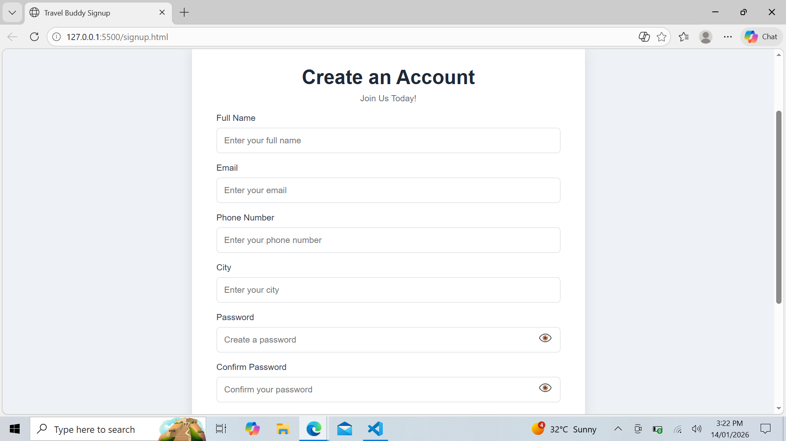
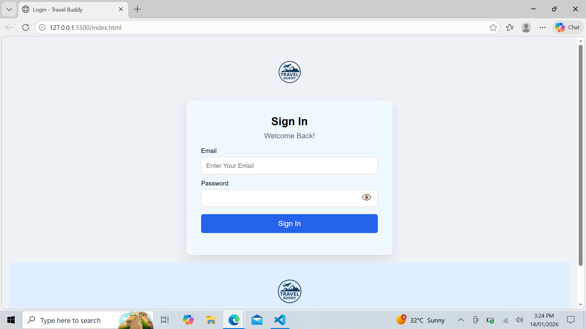

# ✈️ “Responsive Signup and Signin Page with JavaScript Validations”

A simple and responsive **Signup, Signin, and Forgot Password** authentication system built using **HTML, CSS, and JavaScript**, with user data stored in **localStorage**.

This project is designed for **frontend learning, demos, and small applications** where a backend is not required.

---

## 🚀 Features

### 🔐 Signup
- Full name, email, phone number, and city
- Password strength indicator
- Confirm password validation
- Show/Hide password toggle
- Prevents duplicate email registration
- Stores registered users in `localStorage`

### 🔑 Sign In
- Email and password authentication
- Show/Hide password toggle
- Success and error messages
- Stores logged-in user data in `localStorage`
- Redirects after successful login

### 🔄 Forgot Password
- Reset password using registered email
- Password strength validation
- Updates password in `localStorage`

### 🎨 UI & UX
- Fully responsive (mobile, tablet, desktop)
- Shared authentication CSS
- Accessible inputs and labels
- Autocomplete enabled for better user experience

---

## 🛠️ Technologies Used

- **HTML5**
- **CSS3**
- **JavaScript**
- **localStorage** (Client-side storage)

---

## 📁 Project Structure

```
Travel-Buddy/
│
├── signup.html
├── signin.html
│
├── style/
│   └── auth.css
│
├── script/
│   ├── signUp.js
│   └── signIn.js
│
├── image/
│   └── logo.png
│
└── README.md
```

---

## 🔐 localStorage Structure

### Registered Users
```json
[
  {
    "name": "John Doe",
    "email": "john@example.com",
    "phoneNumber": "9876543210",
    "city": "Kannur",
    "password": "As@12345"
  }
]
```

### Logged-in User
```json
{
  "name": "John Doe",
  "email": "john@example.com"
}
```

---

## 🔑 Password Requirements

- Minimum **8 characters**
- At least **1 uppercase letter**
- At least **1 number**
- At least **1 special character**

---

## ⚠️ Important Notes

- Data is stored in **localStorage**
- Clearing browser data will remove all users
- Browser-specific storage
- **Not suitable for production**
- Intended for **learning and demo purposes**

---


## Repository Link
https://github.com/Thazu121/loginsignup.git

## Screenshot






## 🚧 Future Enhancements

- Modal-based forgot password UI  
- Backend authentication (Node.js / Firebase)  
- Password hashing  
- Email verification  
- Remember Me functionality  

---

## ⭐ Project Purpose

This project demonstrates:
- Client-side authentication logic
- Form validation
- Password strength checking
- localStorage-based user management
- Clean and responsive UI design
